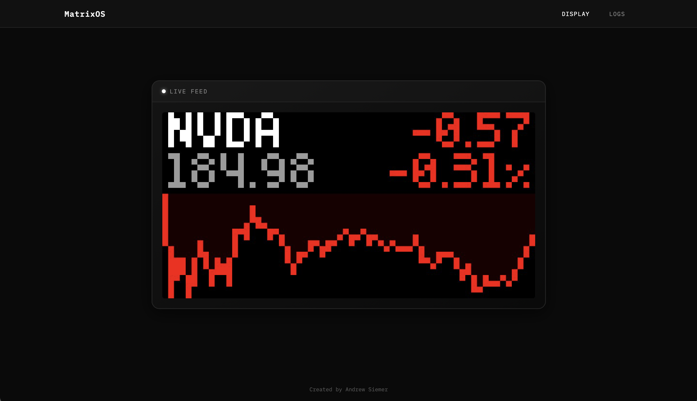
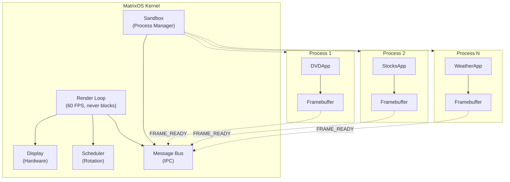
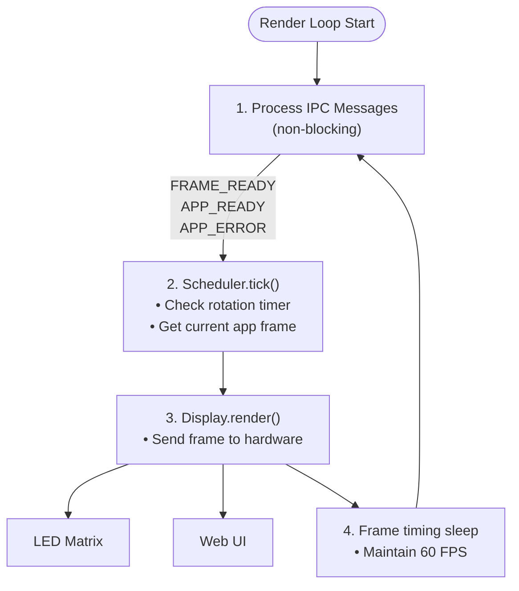
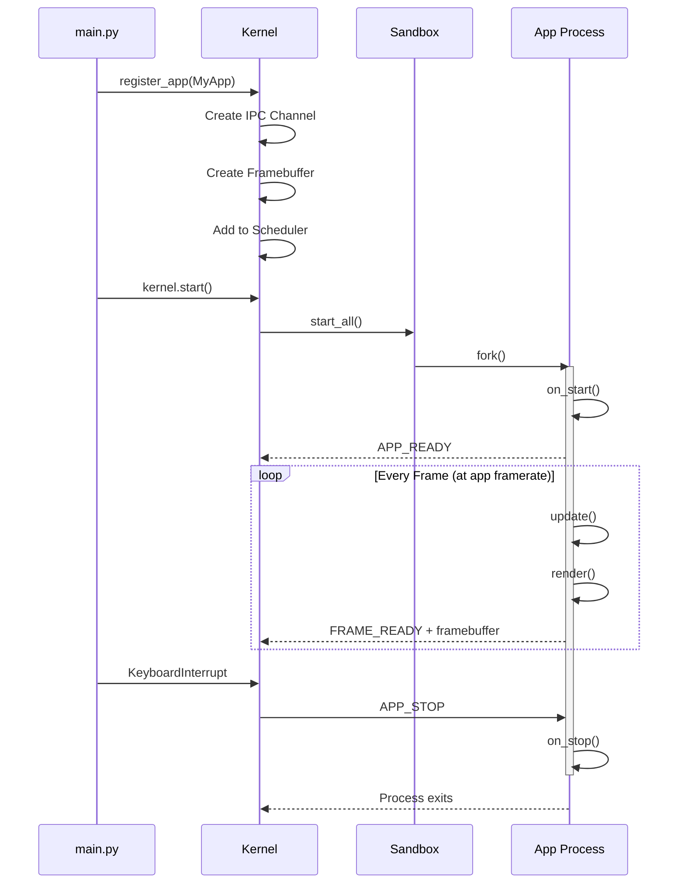
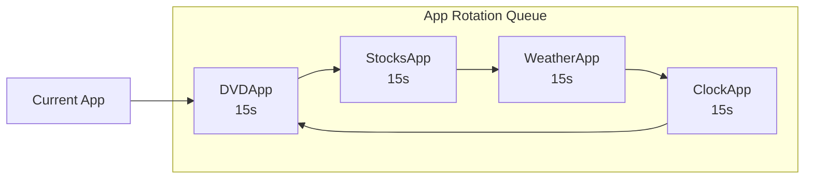
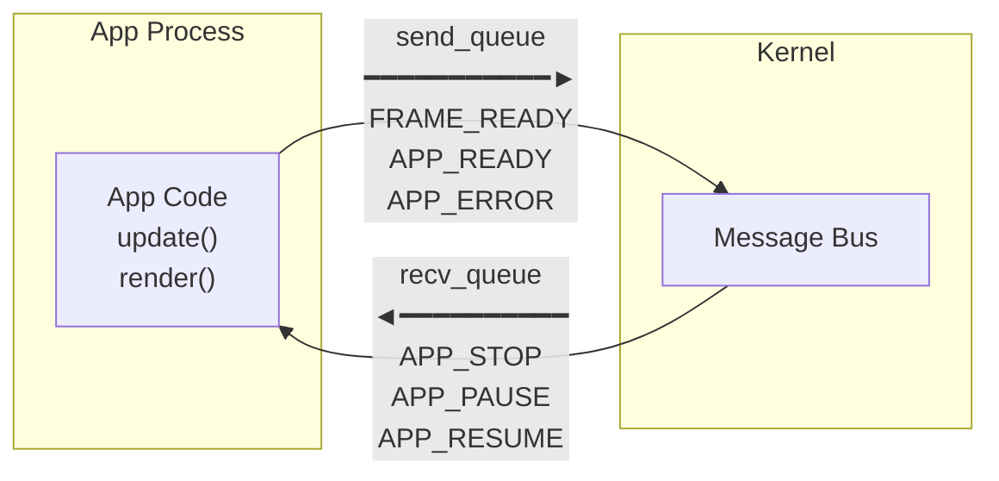

# MatrixOS

A personal LED matrix display system with process-isolated apps.



> **Note**: This is a personal project running on a Raspberry Pi with an [Adafruit RGB Matrix Bonnet](https://learn.adafruit.com/adafruit-rgb-matrix-bonnet-for-raspberry-pi) and a 64x32 LED panel. It is not actively maintained.

## Features

- **Process Isolation**: Each app runs in its own process—crashes don't affect the system
- **Non-blocking Rendering**: Main loop never blocks, even with slow API calls
- **Web Interface**: Real-time MJPEG display stream, log viewer, and app monitoring
- **Hot Swappable Apps**: Register apps dynamically with configurable durations
- **Hardware Abstraction**: Runs on real LED matrices or in simulation mode (without hardware)

## Architecture

```
src/matrix_os/
├── core/                    # System kernel and infrastructure
│   ├── kernel.py           # Main orchestrator, non-blocking render loop
│   ├── display.py          # Hardware abstraction layer
│   ├── ipc.py              # Message bus for app communication
│   ├── sandbox.py          # Process isolation for apps
│   ├── scheduler.py        # App rotation and display scheduling
│   └── config.py           # System configuration (pydantic-settings)
│
├── apps/                    # Process-isolated applications
│   ├── base.py             # Base app class
│   ├── fonts.py            # BDF font loading utilities
│   │
│   ├── clock/              # Clock apps
│   │   └── app.py          # BasicClockApp, BinaryClockApp
│   │
│   ├── dvd/                # DVD bouncing logo
│   │   └── app.py          # DVDApp
│   │
│   ├── earth/              # Earth day/night visualization
│   │   └── app.py          # EarthApp
│   │
│   ├── imageviewer/        # Static image display
│   │   └── app.py          # ImageViewerApp
│   │
│   ├── slack/              # Slack status display
│   │   └── app.py          # SlackStatusApp
│   │
│   ├── stocks/             # Stock ticker with charts
│   │   ├── app.py          # StocksApp
│   │   └── db.py           # SQLite cache for stock data
│   │
│   └── weather/            # Weather display
│       └── app.py          # WeatherApp
│
├── web/                     # Web interface
│   ├── app.py              # FastAPI application
│   ├── static/             # CSS styles
│   └── templates/          # Jinja2 templates
│
└── main.py                  # Entry point
```

## Installation

This project uses a pre-built Python wheel for [rgbmatrix](https://github.com/andrewsiemer/rpi-rgb-led-matrix) (located in `vendor/`) to simplify installation of the [Adafruit RGB Matrix library](https://learn.adafruit.com/32x16-32x32-rgb-led-matrix/library) bindings.

```bash
# Clone the repository
git clone https://github.com/andrewsiemer/matrix-os.git
cd matrix-os

# Install with uv (recommended)
uv sync

# Or with pip
pip install -e .
```

> **Note**: The `rgbmatrix` wheel is built for `linux_armv7l` (Raspberry Pi). On other platforms (macOS, x86 Linux), the wheel won't install but MatrixOS will run in simulation mode.

## Configuration

Create a `.env` file with your API keys:

```bash
# Stocks (TwelveData)
stocks_api_key=your_key

# Slack
slack_user_id=your_user_id
slack_token=your_token

# Weather (OpenWeatherMap)
weather_api_key=your_key
lat=37.7749
lon=-122.4194

# Timezone
local_tz=America/Los_Angeles
```

## Usage

```bash
# Run directly
python src/matrix_os/main.py

# Or as a module
python -m matrix_os

# Or use the CLI entry point
matrix-os

# Custom web server port
matrix-os --port 8080
```

### Web Interface

The web interface starts automatically at `http://localhost:8000` and is **always available**—whether running on actual hardware or in simulation mode. It provides:

- **Live Display**: Real-time MJPEG stream of the matrix display (same output as the physical LEDs)
- **Log Viewer**: SSE-based log streaming with filtering
- **App Status**: Currently running apps and their information

Use it for remote monitoring of your display, or for development without hardware.

## Key Design Principles

### 1. Process Isolation
Every app runs in its own **separate process**. This ensures:
- Network/API calls never block the display
- Crashed apps don't take down the system
- True isolation between apps

### 2. Non-blocking Render Loop
The main render loop in the kernel **never blocks**. Apps submit frames via IPC, and the kernel composites them to the display at a steady rate.

### 3. IPC-based Communication
Apps communicate with the kernel through a message bus:
- Apps submit rendered frames via `FRAME_READY` messages
- Kernel sends lifecycle events (`APP_START`, `APP_STOP`, etc.)
- No direct hardware access from apps

### 4. Framebuffer Rendering
Apps never touch the hardware directly. Instead, they render to a `FrameBuffer`:

```python
def render(self) -> FrameBuffer:
    self.fb.clear()
    self.fb.set_pixel(10, 10, 255, 0, 0)  # Red pixel
    return self.fb
```

## System Diagrams

### Overall System Architecture



### Render Loop Flow

The kernel's render loop runs at 60 FPS and never blocks:



### App Process Lifecycle

Each app runs in complete isolation:



### Scheduler App Rotation

Apps rotate in round-robin order with configurable durations:

```mermaid
gantt
    title App Rotation Timeline
    dateFormat ss
    axisFormat %S

    section Display
    DVDApp      :a1, 00, 15s
    StocksApp   :a2, after a1, 15s
    WeatherApp  :a3, after a2, 15s
    ClockApp    :a4, after a3, 15s
```





### IPC Message Flow

Apps communicate with the kernel via multiprocessing queues:



**Message Types:**

| Direction    | Message       | Description                         |
| ------------ | ------------- | ----------------------------------- |
| App → Kernel | `FRAME_READY` | App submits rendered frame          |
| App → Kernel | `APP_READY`   | App finished initialization         |
| App → Kernel | `APP_ERROR`   | App encountered an error            |
| Kernel → App | `APP_STOP`    | Kernel tells app to shutdown        |
| Kernel → App | `APP_PAUSE`   | Kernel tells app to pause rendering |
| Kernel → App | `APP_RESUME`  | Kernel tells app to resume          |

## Creating Apps

Each app lives in its own folder under `apps/`. Create a new folder with:
- `__init__.py` - exports the app class
- `app.py` - contains the app implementation

Example app structure:

```
apps/myapp/
├── __init__.py
└── app.py
```

**`apps/myapp/__init__.py`:**
```python
from .app import MyApp

__all__ = ["MyApp"]
```

**`apps/myapp/app.py`:**
```python
from ..base import AppManifest, BaseApp
from ...core.display import FrameBuffer

class MyApp(BaseApp):
    @classmethod
    def get_manifest(cls) -> AppManifest:
        return AppManifest(
            name="My App",
            version="1.0.0",
            description="A custom app",
            framerate=30,
        )
    
    def on_start(self) -> None:
        """Called when app starts."""
        self.counter = 0
    
    def update(self) -> None:
        """Update app state (called each frame)."""
        self.counter += 1
    
    def render(self) -> FrameBuffer:
        """Render current frame."""
        self.fb.clear()
        x = self.counter % self.width
        self.fb.set_pixel(x, 16, 255, 255, 255)
        return self.fb
    
    def on_stop(self) -> None:
        """Called when app stops."""
        pass
```

Then register it in `main.py`:

```python
from matrix_os.apps.myapp import MyApp

kernel.register_app(MyApp, duration=15)
```

## App Utilities

Apps have access to several utility methods:

```python
# Load fonts (BDF format)
from ..fonts import get_font

font_path = self.get_font_path("5x6.bdf")
font = get_font(font_path)

# Load images
image_path = self.get_image_path("icon.png")
image = self.load_image(image_path, size=(32, 32))

# Access environment settings
api_key = self.get_env("api_key", default="")
```

## Available Apps

| App              | Description                                        |
| ---------------- | -------------------------------------------------- |
| `BasicClockApp`  | Simple digital clock with configurable timezone    |
| `BinaryClockApp` | Binary representation clock display                |
| `DVDApp`         | Classic DVD logo bouncing animation                |
| `EarthApp`       | Earth with real-time day/night terminator          |
| `ImageViewerApp` | Display static images (PNG, GIF support)           |
| `SlackStatusApp` | Show Slack user status and presence                |
| `StocksApp`      | Stock prices with intraday charts (TwelveData API) |
| `WeatherApp`     | Current weather conditions (OpenWeatherMap API)    |

## Hardware

This project is designed for LED matrix displays using the [rpi-rgb-led-matrix](https://github.com/hzeller/rpi-rgb-led-matrix) library. The Python bindings (`rgbmatrix`) are provided via a [fork](https://github.com/andrewsiemer/rpi-rgb-led-matrix) with a pre-built wheel for easier installation.

### My Setup

- **Raspberry Pi** (any model with GPIO header)
- **[Adafruit RGB Matrix Bonnet](https://www.adafruit.com/product/3211)** (or HAT)
- **64x32 RGB LED Matrix Panel** (HUB75 interface)

### Default Configuration

| Setting          | Value              |
| ---------------- | ------------------ |
| Hardware mapping | `adafruit-hat-pwm` |
| Matrix size      | 64x32 pixels       |
| Chain length     | 1                  |
| Brightness       | 100%               |
| GPIO slowdown    | 4                  |

Modify `core/config.py` to adjust hardware settings for your setup.

### Simulation Mode

When running without hardware (e.g., on macOS or without root), MatrixOS automatically runs in simulation mode. The web interface at `http://localhost:8000` shows exactly what would appear on the physical display.

## Development

```bash
# Install dev dependencies
uv sync --dev

# Run tests
uv run pytest

# Lint
uv run ruff check . --fix

# Format
uv run black .
```

## Credits

- [rpi-rgb-led-matrix](https://github.com/hzeller/rpi-rgb-led-matrix) by Henner Zeller — the core C++ library for driving RGB LED matrices
- [Adafruit](https://learn.adafruit.com/32x16-32x32-rgb-led-matrix/library) — hardware and tutorials for RGB matrix projects

## License

MIT License

---

* Created by [Andrew Siemer](https://github.com/andrewsiemer) • Not actively maintained*
